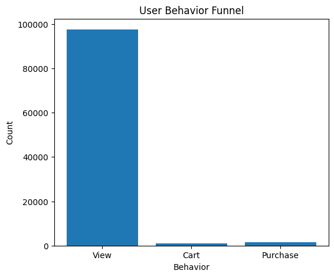
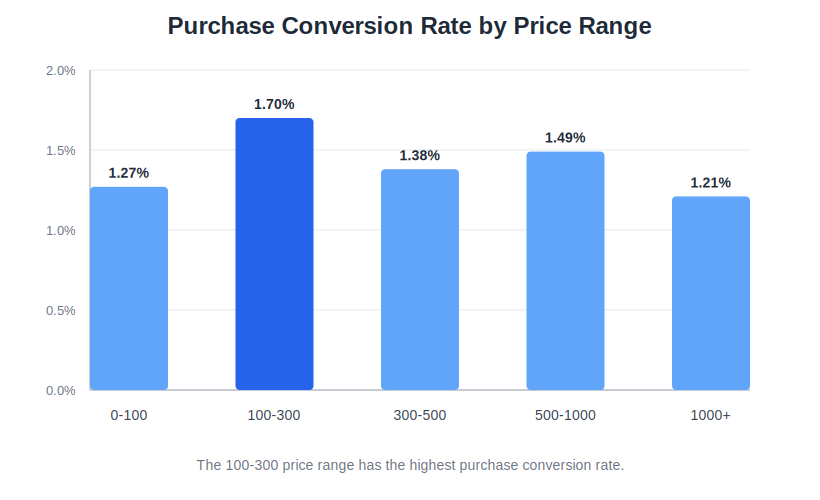
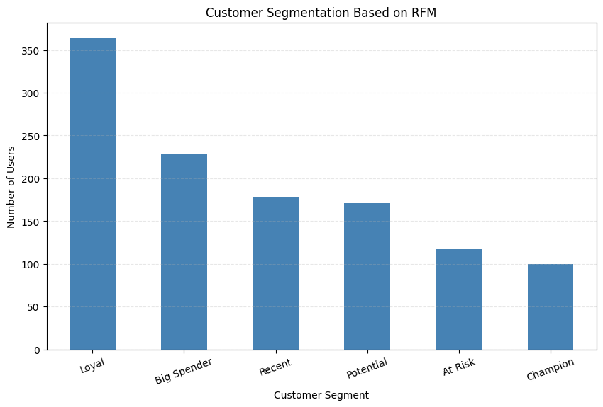
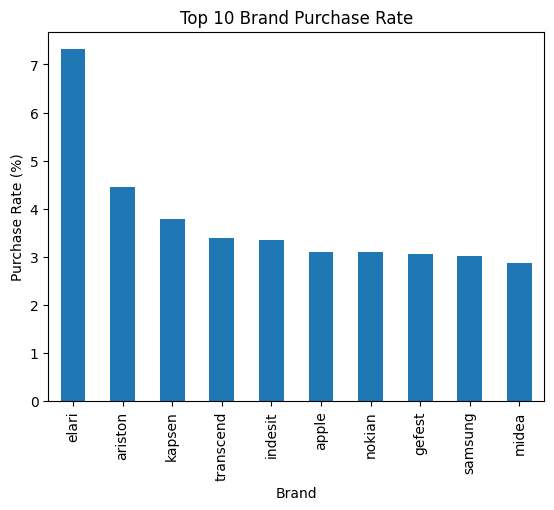

# User Behavior Analysis

## Project Overview

This project analyzes 100,000+ e-commerce user behavior records, including browsing, cart, and purchase events. The goal is to understand user conversion, product and brand performance, price sensitivity, and customer value, then provide data-driven business recommendations.

## Dataset

- Source: `2019-Nov.csv`
- Scale: 100,000+ user interaction records
- Key fields: `user_id`, `event_type`, `product_id`, `category_id`, `brand`, `price`, `event_time`, `user_session`

## Analysis Workflow

1. Data cleaning: missing values, timestamp conversion, abnormal price check.
2. EDA: event distribution, product performance, brand interaction, price distribution.
3. Funnel analysis: `view -> cart -> purchase` conversion path.
4. Price analysis: purchase conversion by price range.
5. RFM analysis: customer value scoring and segmentation.
6. Business recommendations: conversion, pricing, retention, and reactivation strategies.

## Visualizations

### User Behavior Funnel



### Price Range Conversion



### RFM Customer Segmentation



### Brand Purchase Rate



## Key Insights

- Overall purchase conversion rate is low, about 1.46%, showing clear room for funnel optimization.
- The main loss occurs after browsing, before users add products to cart.
- Products in the 100-300 price range show the highest purchase conversion rate.
- RFM segmentation identifies Champion, Loyal, Big Spender, Recent, Potential, and At Risk users.
- High-value users contribute stronger purchase frequency and monetary value, while At Risk users require reactivation.

## Business Recommendations

- Optimize product detail pages and recommendation logic to improve view-to-cart conversion.
- Focus marketing and inventory resources on the 100-300 price range.
- Build VIP benefits and personalized offers for Champion and Loyal users.
- Use coupons, push notifications, and remarketing campaigns to reactivate At Risk users.
- Compare high-traffic brands and high-conversion brands separately when planning advertising budget.

## Tools

- Python
- Pandas
- Matplotlib
- Jupyter Notebook

## Project Structure

```text
User-Behavior-Analysis/
|-- data/          # Raw dataset, not uploaded
|-- images/        # Visualization results
|-- notebook/      # Jupyter analysis notebook
`-- README.md      # Project documentation
```

## Author

SHAXIAOGUANG-AI

Project link: https://github.com/SHAXIAOGUANG-AI/user-behavior-analysis
